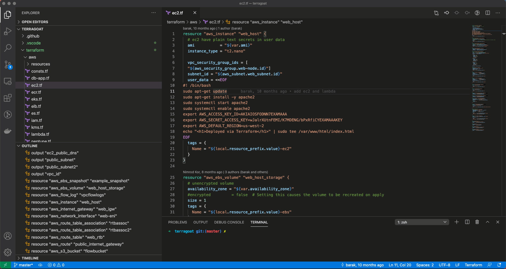
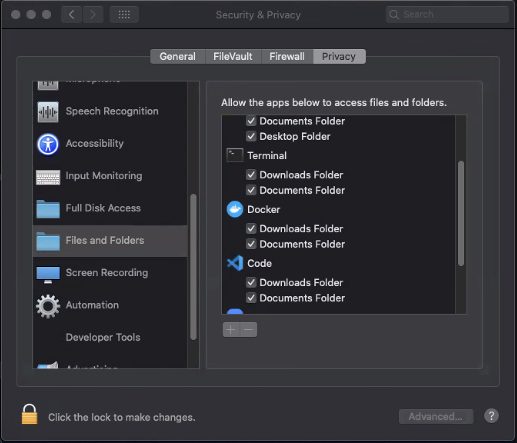

[](https://checkov.io)

[](https://bridgecrew.io/?utm_source=github&utm_medium=organic_oss&utm_campaign=checkov-vscode)
[](https://github.com/bridgecrewio/checkov-vscode/actions?query=workflow%3Abuild)
[](https://marketplace.visualstudio.com/items?itemName=Bridgecrew.checkov)
[](https://slack.bridgecrew.io/?utm_source=github&utm_medium=organic_oss&utm_campaign=checkov-vscode)

# Checkov Extension for Visual Studio Code

[Checkov](https://github.com/bridgecrewio/checkov) is a static code analysis tool for infrastructure-as-code.

The Checkov Extension for VSCODE enables developers to get real-time scan results, as well as inline fix suggestions as they develop cloud infrastructure.



The extension is currently available for download directly from the [Visual Studio Extension Marketplace](https://marketplace.visualstudio.com/items?itemName=Bridgecrew.checkov) and its source code is available in an [Apache 2.0 licensed repository](https://github.com/bridgecrewio/checkov-vscode). Development of the extension is ongoing and it is available for pre-release usage 🚧 .

Activating the extension requires submission of one-time Bridgecrew API Token that can be obtained by [creating a new Bridgecrew platform account](https://docs.bridgecrew.io/docs/get-api-token). It uses open [Bridgecrew Developer APIs](https://docs.bridgecrew.io/reference) to evaluate code and offer automated inline fixes. For more information about data shared with Bridgecrew see the [Disclaimer](#disclaimer) section below).

Extension features include:

* [1000+ built-in policies](https://github.com/bridgecrewio/checkov/blob/master/docs/5.Policy%20Index/all.md) covering security and compliance best practices for AWS, Azure and Google Cloud.
* Terraform, Terraform Plan, CloudFormation, Kubernetes, Helm, Serverless and ARM template scanning.
* Detects [AWS credentials](https://github.com/bridgecrewio/checkov/blob/master/docs/2.Basics/Scanning%20Credentials%20and%20Secrets.md) in EC2 Userdata, Lambda environment variables and Terraform providers.
* In Terraform, checks support evaluation of arguments expressed in [variables](https://github.com/bridgecrewio/checkov/blob/master/docs/2.Basics/Handling%20Variables.md) and remote modules to their actual values.
* Supports inline [suppression](https://github.com/bridgecrewio/checkov/blob/master/docs/2.Basics/Suppressing%20and%20Skipping%20Policies.md) via comments.
* Links to policy descriptions, rationales as well as step by step instructions for fixing known misconfigurations.
* Fix suggestions for commonly misconfigured Terraform and CloudFormation attributes.

## Getting started

### Install

Open the Checkov Extension for Visual Studio Code in the [Visual Studio Marketplace](https://marketplace.visualstudio.com/items?itemName=Bridgecrew.checkov).

### Dependencies

* [Python](https://www.python.org/downloads/) >= 3.7 or [Pipenv](https://docs.pipenv.org/) or [Docker](https://www.docker.com/products/docker-desktop) daemon running

The Checkov extension will invoke the latest version of ```Checkov```.

### Configuration

* Sign up to a Bridgecrew Community account [here](http://bridgecrew.cloud/). If you already have an account, sign in and go to the next step.

* From [Integrations](https://www.bridgecrew.cloud/integrations/api-token), select **API Token** and copy the API key.
* In Visual Studio Code, enter your API Token in the Checkov Extension settings page.  
* Using a custom CA certificate is possible. If needed, set the path to the certificate file in the Checkov Extension settings page.

* If you find the error message noisy, you're able to disable it entirely by selecting `Disable error message` in the Checkov Extension settings page.


### Usage

* Open a file you wish to scan with checkov in VSCode.
* Open the command palette (⇧⌘P) and run the command `Checkov Scan`.
* Scan results should now appear in your editor.
* Click a scan to see its details. Details will include the violating policy and a link to step-by-step fix guidelines.
* In most cases, the Details will include a fix option. This will either add, remove or replace an unwanted configuration, based on the Checkov fix dictionaries.
* You can skip checks by adding an inline skip annotation ```checkov:skip=<check_id>:<suppression_comment>```. For more details see the [docs](https://github.com/bridgecrewio/checkov/blob/master/docs/2.Concepts/Suppressions.md).
* The extension will continue to scan file modifications and highlight errors in your editor upon every material resource modification.

### Troubleshooting logs

To access checkov-vscode logs directory, open the VSCODE Command Palette `(Ctrl+Shift+P)`, run the command `Developer: Open Extensions Logs Folder`, and the log file should be inside the `Bridgecrew.checkov` folder.

### Common Issues
#### Docker file access permissions on MacOS

If you are getting failures and are running the Checkov extension via Docker, it's possible MacOS needs to give Docker permission to access the directory location of your code.
In MacOS `System Preferences > Privacy and Security > Privacy` Find the `Files and Folders` section from the list, and ensure `Docker` has access to your code location.



Symptoms of this issue can be found in the extension logs, you will see `[info]: Running Checkov` with `executablePath: docker` and then output showing zero passed, failed, or skipped checks, and 1+ parsing errors, as below:

```shell
[info]: Running checkov {“executablePath”:“docker”,“arguments”
...
...
[debug]: Checkov task output:
...
 \“passed\“: 0,\r\n        \“failed\“: 0,\r\n        \“skipped\“: 0,\r\n        \“parsing_errors\“: 1,\r\n        \“checkov_version\“: \“1.0.770\“\r\n    }
```

## Contributing

Contribution is welcomed!

Start by reviewing the [contribution guidelines](https://github.com/bridgecrewio/checkov/blob/master/CONTRIBUTING.md). After that, take a look at a [good first issue](https://github.com/bridgecrewio/checkov/issues?q=is%3Aissue+is%3Aopen+label%3A"good+first+issue").

Looking to contribute new checks? Learn how to write a new check (AKA policy) [here](https://github.com/bridgecrewio/checkov/blob/master/docs/5.Contribution/New-Check.md).

## Disclaimer

To use this checkov-vscode extension, you will need to create a free account at bridgecrew.cloud using your e-mail, the plugin uses Bridgecrew.cloud's fixes API to analyse and produce code fixes, and enrich the results provided into VSCode. Please notice bridgecrew [privacy policy](https://bridgecrew.io/privacy-policy/?utm_source=github&utm_medium=organic_oss&utm_campaign=checkov-vscode) for more details on collected data when using bridgecrew application.
To generate fixes, files found to have triggered checkov violations are made available to the fixes API for the sole purpose of generating inline fixes code recommendations.

## Support

[Bridgecrew](https://bridgecrew.io/?utm_source=github&utm_medium=organic_oss&utm_campaign=checkov-vscode) builds and maintains Checkov to make policy-as-code simple and accessible.

Start with our [Documentation](https://bridgecrewio.github.io/checkov/) for quick tutorials and examples.

If you need direct support you can contact us at [info@bridgecrew.io](mailto:info@bridgecrew.io).
